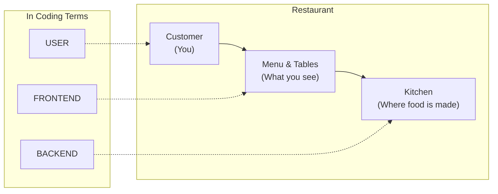
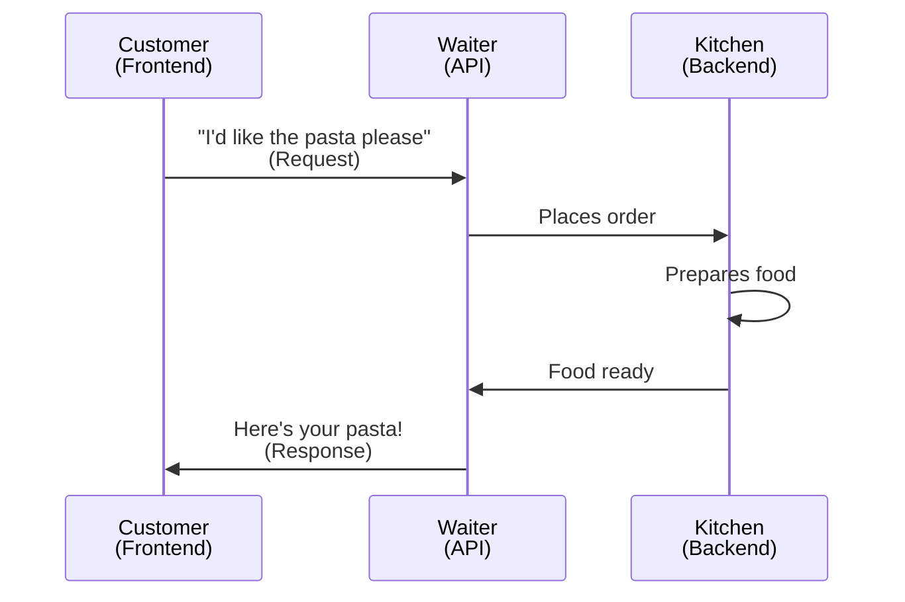
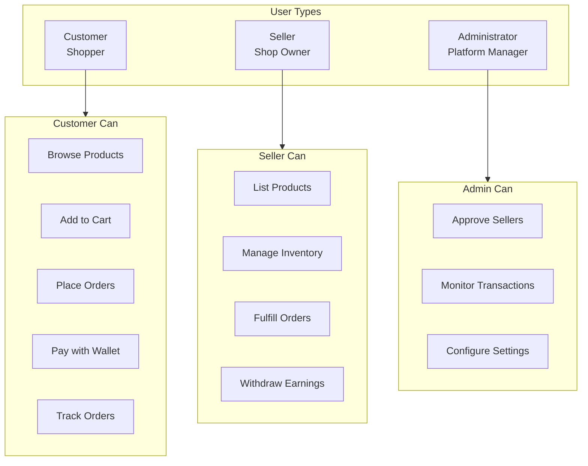
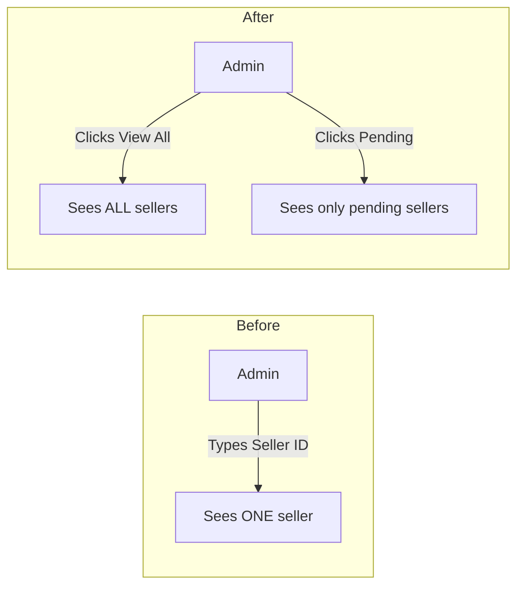
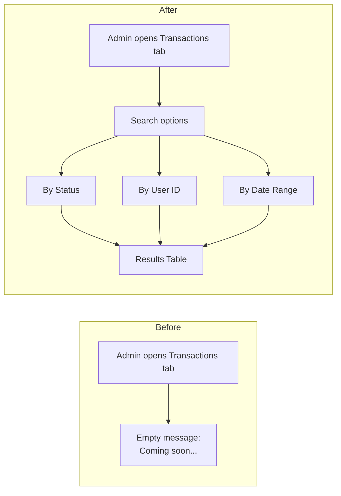
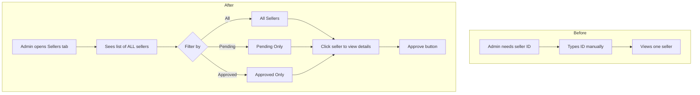
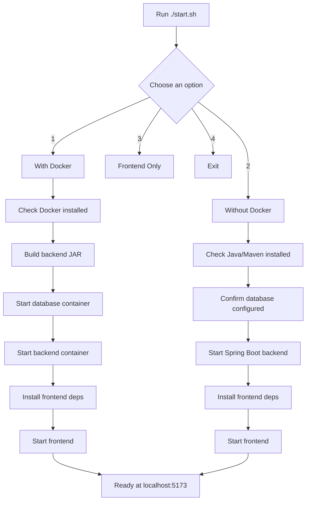
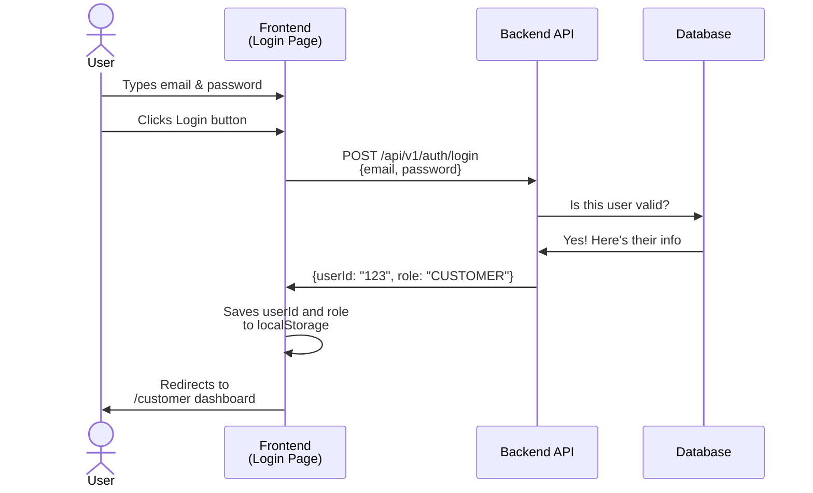
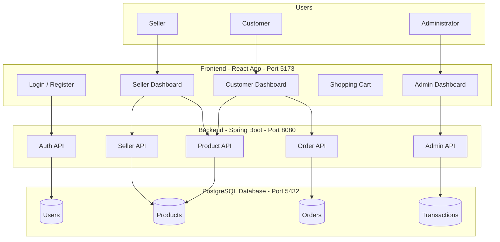

# Understanding the Changes We Made

This document explains the changes in simple terms for anyone new to coding.

---

## First, Let's Understand the Basics

### What is a Web Application?

Think of a web application like a **restaurant**:



### The Three Main Parts

#### 1. Frontend (The Dining Area)
- **What it is**: Everything you see and interact with on a website
- **Examples**: Buttons, forms, images, menus, the login page
- **Restaurant analogy**: The dining area, menu, tables, decorations
- **Our tech**: React (JavaScript library for building user interfaces)

#### 2. Backend (The Kitchen)
- **What it is**: The "brain" that processes requests and handles data
- **Examples**: Checking if your password is correct, calculating totals, saving orders
- **Restaurant analogy**: The kitchen where chefs prepare food
- **Our tech**: Spring Boot (Java framework)

#### 3. Database (The Storage Room)
- **What it is**: Where all the information is permanently stored
- **Examples**: User accounts, products, orders, transaction history
- **Restaurant analogy**: The pantry/storage room with all ingredients and records
- **Our tech**: PostgreSQL

---

## What is an API?

**API** stands for **Application Programming Interface**.

Think of it as the **waiter** in our restaurant:



- You (customer) don't go into the kitchen yourself
- You tell the waiter what you want
- The waiter brings it back to you

In coding terms:
- The **frontend** doesn't directly access the database
- It sends a **request** to the **API**
- The **backend** processes it and sends back a **response**

---

## What is an Endpoint?

An **endpoint** is like a specific item on a menu that the waiter can bring you.

**Example endpoints in our app:**

| What You Want | Endpoint (Menu Item) | What Happens |
|---------------|---------------------|--------------|
| See all products | `/api/v1/products/all` | Kitchen sends list of all products |
| Login | `/api/v1/auth/login` | Kitchen checks your username/password |
| Place an order | `/api/v1/customer/{id}/order/{productId}` | Kitchen creates a new order |
| Approve a seller | `/api/v1/admin/sellers/{id}/approve` | Kitchen marks seller as approved |

The `/api/v1/` part is like saying "I'm ordering from the main menu, version 1"

---

## Our Application: PASAR

PASAR is an e-commerce platform (like a simple Shopee or Lazada) with three types of users:



---

## What Changes Did We Make?

### Change 1: Added a Way to See All Sellers (Backend)

**The Problem**:
Before, the admin could only look up ONE seller at a time by typing their ID. That's like a restaurant manager having to remember every employee's ID number!

**What We Added**:
A new "menu item" (endpoint) that lets the admin see ALL sellers at once.

**Files Changed**:
```
Backend/
├── Authentication/AuthenticationRepository.java  ← Added search queries
├── Administrator/AdministratorService.java       ← Added business logic
└── Administrator/AdministratorController.java    ← Added the new endpoint
```

**Before vs After**:



---

### Change 2: Admin Can Now Monitor Transactions (Frontend)

**The Problem**:
The admin dashboard had a "Transactions" tab, but it just showed a message saying "coming soon". The backend could already provide transaction data, but the frontend wasn't using it!

**What We Added**:
Connected the frontend to the backend so admins can actually search and view transactions.

**Files Changed**:
```
Frontend/
├── services/adminApi.js           ← Added functions to call transaction endpoints
├── pages/AdminDashboard.jsx       ← Added the transaction search interface
└── styles/AdminDashboardStyle.css ← Added styling for tables and popups
```

**Before vs After**:



**What the Transactions Tab Looks Like**:

```mermaid
flowchart TB
    subgraph TransactionsTab [Transactions Tab]
        SearchOptions[Search by:<br/>Status / User ID / Date Range]
        SearchOptions --> SearchButton[Search Button]
        SearchButton --> ResultsTable

        subgraph ResultsTable [Results Table]
            Header[ID<br/>From<br/>To<br/>Amount<br/>Status<br/>Date]
            Row1[abc123<br/>john@..<br/>shop@..<br/>RM 50<br/>PAID]
            Row2[def456<br/>jane@..<br/>mart@..<br/>RM 120<br/>PAID]
        end
    end
```

---

### Change 3: Improved Seller Management (Frontend)

**The Problem**:
To approve a seller, the admin had to know the seller's ID beforehand. There was no way to see a list of sellers waiting for approval.

**What We Added**:
A list that shows all sellers, with buttons to filter by "Pending" or "Approved" status.

**Files Changed**:
```
Frontend/
├── services/adminApi.js      ← Added function to get all sellers
└── pages/AdminDashboard.jsx  ← Added the seller list interface
```

**Before vs After**:



---

### Change 4: Created Seller Dashboard (New Feature!)

**The Problem**:
Sellers could register, but there was no page for them to manage their shop!

**What We Added**:
A complete dashboard for sellers with three sections:

**Files Created**:
```
Frontend/
├── pages/SellerDashboard.jsx       ← The main page (NEW FILE)
├── styles/SellerDashboard.css      ← Styling for the page (NEW FILE)
├── services/api.js                 ← Added helper function
└── App.jsx                         ← Added route so users can access /seller
```

**The Seller Dashboard Structure**:

```mermaid
flowchart TB
    subgraph SellerDashboard [Seller Dashboard]
        Tabs[Tabs: My Products | Orders | Wallet]

        subgraph ProductsTab [My Products Tab]
            ProductList[Product Cards Grid]
            AddButton[+ Add Product Button]
            EditDelete[Edit / Delete Buttons]
        end

        subgraph OrdersTab [Orders Tab]
            OrderTable[Orders Table]
            StatusDropdown[Shipment Status Dropdown:<br>Processing / Shipped / Delivered]
        end

        subgraph WalletTab [Wallet Tab]
            Balance[Balance Display: RM X,XXX.XX]
            WithdrawForm[Withdraw Amount Input]
            WithdrawButton[Withdraw Button]
        end

        Tabs --> ProductsTab
        Tabs --> OrdersTab
        Tabs --> WalletTab
    end
```

---

### Change 5: Updated Documentation (README)

**What We Added**:
- How the system works (architecture diagram)
- How to set up and run the project
- List of all features and API endpoints
- Troubleshooting tips

**File Changed**:
```
README.md
```

---

### Change 6: Created Startup Script

**The Problem**:
Starting the application required running multiple commands in the right order.

**What We Added**:
A single script that guides you through starting everything.

**File Created**:
```
start.sh
```

**How the Script Works**:



---

## Summary of All Changes

| What | Why | Files |
|------|-----|-------|
| List all sellers | Admin couldn't see pending sellers easily | 3 backend files |
| Transactions tab | Admin couldn't monitor payments | 3 frontend files |
| Seller list view | Admin had to memorize seller IDs | 2 frontend files |
| Seller dashboard | Sellers had no management page | 5 frontend files |
| README update | No documentation existed | 1 file |
| Startup script | Setup was complicated | 1 file |

---

## Glossary

| Term | Simple Explanation |
|------|-------------------|
| **Frontend** | The part of the app you see and click on |
| **Backend** | The part that processes data (hidden from users) |
| **Database** | Where all information is permanently stored |
| **API** | The messenger between frontend and backend |
| **Endpoint** | A specific "door" where you can request something |
| **Route** | A URL path like `/seller` or `/admin` |
| **Component** | A reusable piece of the user interface (like a button) |
| **Repository** | Code that talks to the database |
| **Service** | Code that contains business logic |
| **Controller** | Code that receives requests and sends responses |

---

## Visual: How a Login Works



---

## The Full System Architecture



---

## Questions?

If anything is still confusing, here are some resources:
- [MDN Web Docs](https://developer.mozilla.org/) - Great for web basics
- [React Documentation](https://react.dev/) - Learn about our frontend
- [Spring Boot Guides](https://spring.io/guides) - Learn about our backend

Remember: Everyone was a beginner once. Don't be afraid to ask questions!
